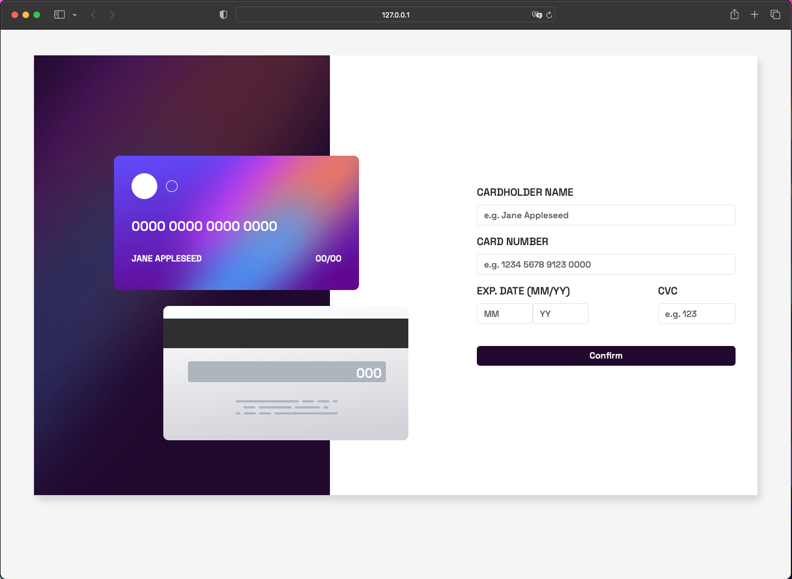
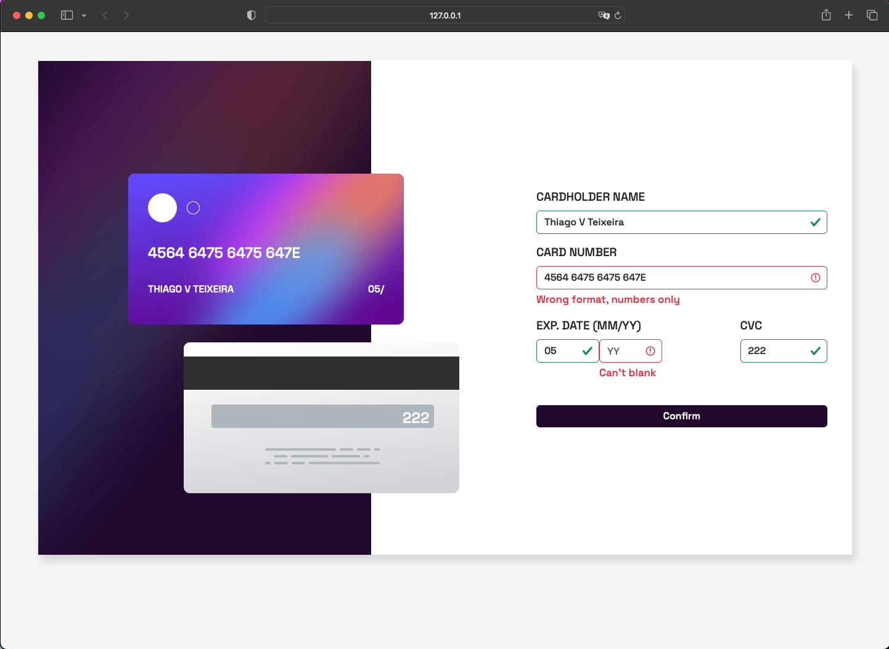
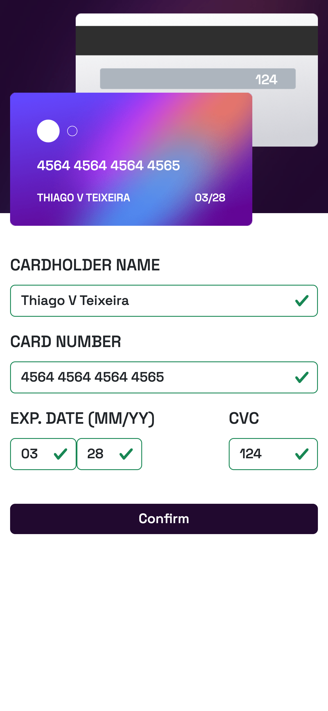
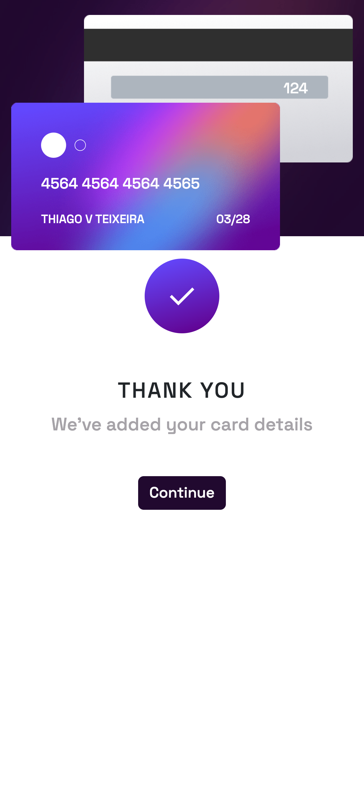

# Frontend Mentor - Interactive card details form solution

This is a solution to the [Interactive card details form challenge on Frontend Mentor](https://www.frontendmentor.io/challenges/interactive-card-details-form-XpS8cKZDWw). Frontend Mentor challenges help you improve your coding skills by building realistic projects. 

## Table of contents

- [Overview](#overview)
  - [The challenge](#the-challenge)
  - [Screenshot](#screenshot)
  - [Links](#links)
- [My process](#my-process)
  - [Built with](#built-with)
  - [What I learned](#what-i-learned)
  - [Continued development](#continued-development)
- [Author](#author)


## Overview

### The challenge

Users should be able to:

- Fill in the form and see the card details update in real-time
- Receive error messages when the form is submitted if:
  - Any input field is empty
  - The card number, expiry date, or CVC fields are in the wrong format
- View the optimal layout depending on their device's screen size
- See hover, active, and focus states for interactive elements on the page

### Screenshot







### Links

- Solution URL: [Add solution URL here](https://your-solution-url.com)
- Live Site URL: [Add live site URL here](https://your-live-site-url.com)

## My process

### Built with

- Semantic HTML5 markup
- CSS custom properties
- Mobile-first workflow
- [Bootstrap 5](https://getbootstrap.com/docs/5.0/getting-started/introduction/) - Bootstrap 5 Framework
- [Cleave.js](https://nosir.github.io/cleave.js/) - Cleave Mask Input


### What I learned

What I learned in making this challenge is:

  1. Layout with Bootstrap 5
  2. Forms using Bootstrap 5
  3. Mask input with Cleave.js 
  4. Create validation with javascript


```js
// input card number mask

new Cleave(cardNumberInput, {
  blocks: [4, 4, 4, 4],
  delimiters: [' ', ' ', ' ']
});

// validate form and complete state mensagem 

(() => {
  'use strict';

  const forms = document.querySelectorAll('.needs-validation');
  let isFormVisible = true; 
  Array.prototype.slice.call(forms).forEach((form) => {
    form.addEventListener('submit', (event) => {
      event.preventDefault();
      event.stopPropagation();
      
      const cardNumberInput = form.querySelector('#cardnumber');
      const invalidCardNumberFeedback = form.querySelector('#invalid-cardnumber');

      if (cardNumberInput.value.trim() === '') {
        invalidCardNumberFeedback.textContent = "Can't be blank";
      } else if (!/^[0-9 ]{19}$/.test(cardNumberInput.value)) {
        invalidCardNumberFeedback.textContent = 'Wrong format, numbers only';
      } else {
        invalidCardNumberFeedback.textContent = '';
        if (form.checkValidity()) {
          const formContent = document.querySelector('#form-content');
          const complete = document.querySelector('.complete');
  
          if (isFormVisible) {
            formContent.style.display = 'none';
            complete.style.display = 'flex';
          } else {
            formContent.style.display = 'flex';
            complete.style.display = 'none';
          }
  
          isFormVisible = !isFormVisible;
        }
      }

      form.classList.add('was-validated');
    }, false);
  });
})();
```

### Continued development

 I want continue develop and study other frameworks as react and angular for to improve my skills

## Author

- Frontend Mentor - [@thiagovasconcelosteixeira](https://www.frontendmentor.io/profile/thiagovasconcelosteixeira)
- Instagram - [@dev.thiagovt](https://www.twitter.com/yourusername)


